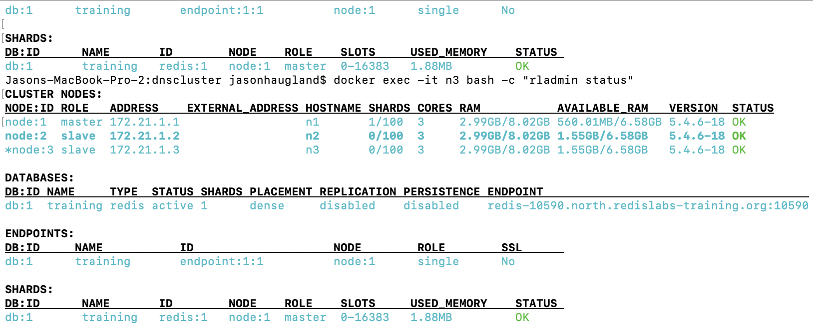
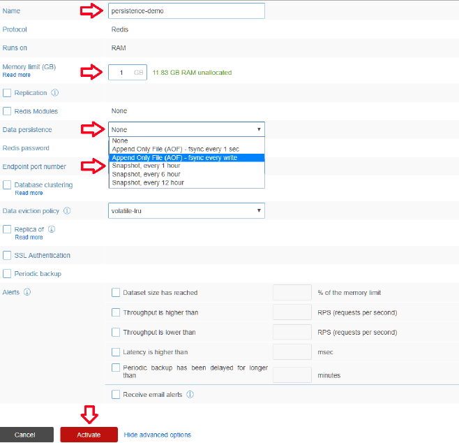
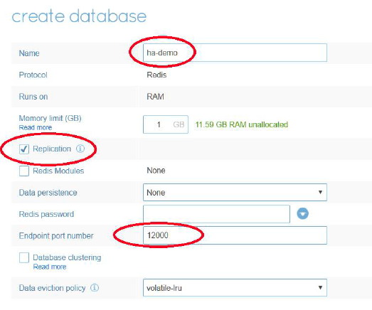
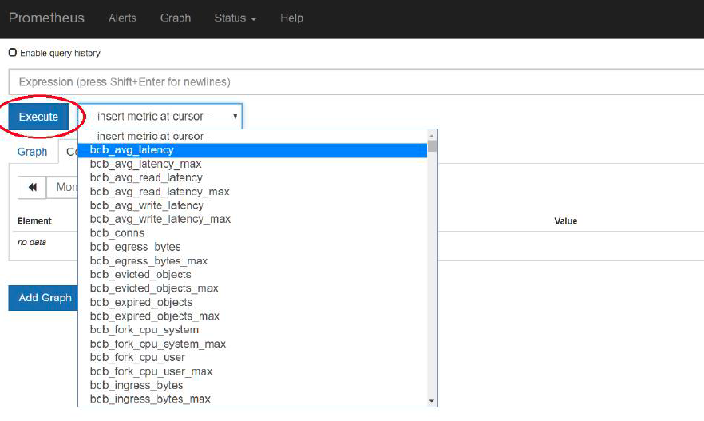
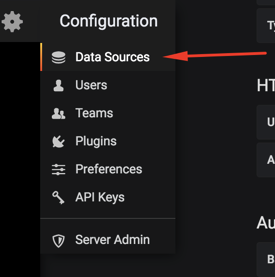
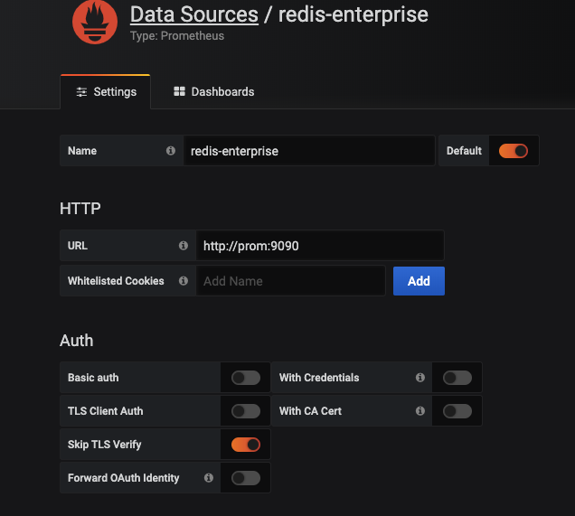

## A 3 node Redis Enterprise cluster setup in Docker containers (For Development purpose only)

This is heavily lifted from work by Virag Trapathi.  I just took his work and added docker-compose and volumes.  He did the hard parts!!
for more detail and additional content see:   https://github.com/viragtripathi/redis-enterprise-docker

### Prerequisites

Docker compatible OS and Docker installed.
  - (I have it setup on my MacBook Pro but you can run it on any OS with Docker as long as you tweak the script based on runtime requirements.)
Update Docker resources with 4 CPUs and 6-10GB RAM as shown here, <a href="https://github.com/viragtripathi/redis-enterprise-docker/blob/master/Screen%20Shot%202019-06-19%20at%2011.55.53%20AM.png">Docker Preferences...</a>

## Steps for 3 node cluster
1. Change directory to cluster3node
```
cd cluster3node
```

2. Execute create_redis_enterprise_3_node_cluster.sh to create a 3 node(server) Redis Enterprise cluster
```
./create_redis_enterprise_3_node_cluster.sh
```
3. execute createDB.sh to create a database
```
./createDB.sh
```
4. Execute cleanup.sh to kill and remove the 3 docker containers. [OPTIONAL]

5. Execute destroy.sh to remove the containers and also delete the <a href="https://hub.docker.com/r/redislabs/redis">redislabs/redis</a> images. [OPTIONAL]

6. Execute remove_volumes.sh to remove the redis volumes for the containers

## Steps for CRDB test

1. Change directory to crdb2node

2. Execute create_redis_enterprise_2_node_cluster.sh to create 2 separate one node clusters

3. execute createCRDB.sh to create a CRDB clustered database on each cluster

4. test writing in each cluster and seeing result in other cluster
```
sudo docker exec -it re-node1 bash
redis-cli -p 12005
set hello1 on1
get hello2
```

```
sudo docker exec -it re-node2 bash
redis-cli -p 12005
set hello2 on2
get hello1
```
5. test simultaneous increment and decrement
start increment on cluster1
```
./testincr.sh
```
start decrement on cluster2
```
./testdecr.sh
```

6. take node 1 out of the network using 
```
docker network disconnect crdb2node_default re-node1
```

7. test writing and see that values don't update
```
sudo docker exec -it re-node1 bash
redis-cli -p 12005
set nogo1 on1
get nogo2
```

```
sudo docker exec -it re-node2 bash
redis-cli -p 12005
set nogo2 on2
get nogo1
```

8. restore the network and the entries will come back
```
docker network connect crdb2node_default re-node1
```
## Steps for dns redis cluster
1. Change directory to dnscluster
2. To bring up cluster
```bash
./reset_north_cluster.sh
```
6. Can shutdown all resources
```bash
./shutdown_all.sh
```
## Utilizing the setup
A variety of tests and explorations of Redis Enterprise can be taken with
this setup.  Some of these tests will be documented below
###  A few tips
1.  Validate running containers and note port mappings 
```bash
docker ps
```
2.  get the IP for any node
Use provided scripts to get the IP address for any node.
```bash
./getip.sh
```
Can also get the IP address by referencing docker-compose.yml as IPs are hardcoded in the yaml
3.  User name and password will be  admin@redislabs-training.org / admin
### go through light tutorial
1. Create north 3 node cluster
```bash
./create_north_cluster.sh
```
2. Use browser to Go to Managemnent UI for node <https://localhost:21443>
login to browser using:  admin@redislabs-training.org / admin
3. Click next to create a redis database
4. Provide the database name, set the memory limit and click “Activate”.
Can use:  name=training  memory limit = 1GB
Note the endpoint name and port number as those will be needed to connect
Without entering port on creation, it will be generated. Below is example
```bash
redis-10590.north.redislabs-training.org:10590
```
5. Confirm database configuration matches using rladmin from node 3
```bash
docker exec -it n3 bash 
rladmin status
```
6. Confirm database configuration matches using REST API (still running from the n3 bash)
Make sure to verify the database name as this is likely different than below
```bash
curl -k -u "admin@redislabs-training.org:admin" -H 'Content-type: application/json' -X GET https://redis-10590.north.redislabs-training.org:9443/v1/bdbs/1
```
Output should resemble this:  

7.  Can delete the database using the API.  verify database ID with rladmin output.  This example is assuming the ID is "1"
```bash
curl -k -u "admin@redislabs-training.org:admin" -H 'Content-type: application/json' -X DELETE https://redis-10590.north.redislabs-training.org:9443/v1/bdbs/1
```
8.  Create JSON file with database config (still from n3 bash)
```bash
echo { \"name\": \"demo-db\", \"memory_size\": 1073741824, \"port\": 12000 } > /tmp/create_db.json
```
9.  Create database using the REST API (from n3 bash)
```bash
curl -k -u "admin@redislabs-training.org:admin" -H 'Content-type: application/json' -d @/tmp/create_db.json -X POST https://north.redislabs-training.org:9443/v1/bdbs
```
10.  Confirm the database was created using rladmin
```bash
rladmin status
```
11.  Add data to the database
Note: first exit leaves redis-cli and then second exit leaves n3 bash shell
```bash
redis-cli -h redis-12000.north.redislabs-training.org -p 12000
set hello world
exit
exit  
```
12.  Simulate Node Failure with Standalone Shard (there is no slave shard so database will fail)
```bash
docker stop n1
```
13.  Verify database is down 
```bash
docker exec -it n3 bash -c "rladmin status"
```
14.  Simulate Node Failure with Standalone Shard (there is no slave shard so database will fail) and check status
Database is down and node 2 is now in master role
```bash
docker stop n1
docker exec -it n3 bash 
rladmin status
```
15.  Check do see if data still exists (spoiler alert:  it is gone!)
this exit leaves the redis-cli so in n3 bash
```bash
redis-cli -h redis-12000.north.redislabs-training.org -p 12000
keys *
exit
```
16.  Can delete the database using the API.  verify database ID with rladmin output.  This example is assuming the is is "2".  Also, verify the database was deleted by running rladmin status again
```bash
curl -k -u "admin@redislabs-training.org:admin" -H 'Content-type: application/json' -X DELETE https://redis-12000.north.redislabs-training.org:9443/v1/bdbs/2
rladmin status
```
## Persistence testing
1. Create new database with AOF using <https://localhost:21443>
Provide a database name=persistence-demo, change memory limit=1GB, choose AOF (fsynch every write) data persistence, set
Endpoint port number to 12000 and click on “Activate”

2. Test status of databse and add data to database
```bash
docker exec -it n3 bash 
rladmin status
redis-cli -h redis-12000.north.redislabs-training.org -p 12000
set hello world
exit
```
3. Verify persistence of data with node failure and restart
```bash
docker stop n1
docker exec -it n3 bash -c "rladmin status"
docker start n1
docker exec -it n3 bash 
rladmin status
redis-cli -h redis-12000.north.redislabs-training.org -p 12000
keys *
exit
4. Delete persistence database
```bash
curl -k -u "admin@redislabs-training.org:admin" -H 'Content-type: application/json' -X DELETE https://redis-12000.north.redislabs-training.org:9443/v1/bdbs/2
rladmin status
```
## node failure with replication
1. Create new database with replication using <https://localhost:21443>, verify, and add data
Provide a database name=ha-demo, change memory limit=1GB, choose AOF persistent replication, set
Endpoint port number to 12000 and click on Activate

```bash
docker exec -it n3 bash 
rladmin status
redis-cli -h redis-12000.north.redislabs-training.org -p 12000
set hello world
exit
```
2. Check ping resolution of database
```bash
ping redis-12000.north.redislabs-training.org
```
3. Simulate node failure, verify failure over to replica and zero data loss
The ping will show database is now on node 2 IP instead of node 1
However, notice that slave on node 1 does not come up
```bash
docker stop n1
docker exec -it n3 bash
rladmin status
redis-cli -h redis-12000.north.redislabs-training.org -p 12000
keys *
exit
ping redis-12000.north.redislabs-training.org
```
## Enable slave HA
1. Verify slave HA is disabled by default (note the "slave_ha: disabled")
```bash
docker exec -it n3 bash 
rladmin info cluster
```
2. Enable Slave High Availability, verify "slave_ha: enabled", see slave come back on-line
```bash
rladmin tune cluster slave_ha enabled
rladmin tune cluster slave_ha_grace_period 0
rladmin tune cluster slave_ha_cooldown_period 0
rladmin tune cluster slave_ha_bdb_cooldown_period 0
rladmin info cluster
rladmin status
```
## Active-Active - not enough resources on my machine so I stopped on this part.  Better to do this on by crbd directory above
			same problem with doing replica-of here
1. this is file to create both but not tested... ./create_north_and_south_cluster.sh

## Monitoring with Prometheus and Grafana
more information [Redis, Prometheus, Grafana integration](https://docs.redislabs.com/latest/rs/administering/monitoring-metrics/prometheus-integration/)

1.  Create JSON file with database config (still from n3 bash)
```bash
docker exec -it n3 bash 
echo { \"name\": \"metrics-db\", \"memory_size\": 1073741824, \"port\": 12000 } > /tmp/create_metrics_db.json
```
2.  Create database using the REST API (from n3 bash)
```bash
curl -k -u "admin@redislabs-training.org:admin" -H 'Content-type: application/json' -d @/tmp/create_metrics_db.json -X POST https://north.redislabs-training.org:9443/v1/bdbs
rladmin status
```
3.  Generate Data with memtier_benchmark
```bash
memtier_benchmark -s redis-12000.north.redislabs-training.org -p 12000 --ratio=1:4 --test-time=600 -d 100 -t 3 -c 20 --pipeline=25 --key-pattern=S:S -x 10 --hide-histogram
```
4. View Metrics using the REST API
```bash
curl -k https://north.redislabs-training.org:8070/metrics
```
5. Access the Prometheus UI and execute a query
<http://localhost:9090/graph>
Choose a metric from the dropdown labeled “insert metric at cursor” then click “Execute”

6. Set up Grafana Data Source
<http://localhost:3000/>
use admin and P@ssword for username and password
In the Grafana configuration menu, select Data Sources.

Add the new datasource:

*  Name: redis-enterprise
*  Type: Prometheus
*  URL: http://prom:9090
*  "Skip TLS Verify"


## DNS tips
To be able to debug dns issues, need dnsutils.
1.  Install dnsutils on n3
```bash
docker exec -it --user root n3
apt-get update
apt-get install dnsutils -y
```
2.  Verify can resolve database name (example dependent on port)
```bash
- opcode: QUERY, status: NOERROR, id: 44648
;; flags: qr rd ra; QUERY: 1, ANSWER: 1, AUTHORITY: 3, ADDITIONAL: 1

;; OPT PSEUDOSECTION:
; EDNS: version: 0, flags:; udp: 4096
; COOKIE: 185ef1ef6e7a841dbab8a04c5df24ae8112dc67705fecbab (good)
;; QUESTION SECTION:
;redis-18959.north.redislabs-training.org. IN A

;; ANSWER SECTION:
redis-18959.north.redislabs-training.org. 5 IN A 172.21.1.1

;; AUTHORITY SECTION:
north.redislabs-training.org. 38400 IN	NS	n3.north.redislabs-training.org.
north.redislabs-training.org. 38400 IN	NS	n2.north.redislabs-training.org.
north.redislabs-training.org. 38400 IN	NS	n1.north.redislabs-training.org.

;; Query time: 18 msec
;; SERVER: 172.21.1.4#53(172.21.1.4)
;; WHEN: Thu Dec 12 14:12:56 UTC 2019
;; MSG SIZE  rcvd: 164
```
3. To access dns server from browser
```bash
https://localhost:10000
```
4. DNS database is included.  This is setup
* Delete all existing DNS zones
* Add a new master zone with domain name redislabs-training.org using ns.redislabs-training.org
* address records
	* add address record for ns.redislabs-training.org with 172.21.1.4 for address
	* add address record for n1.north.redislabs-training.org with 172.21.1.1
	* add address record for n2.north.redislabs-training.org with 172.21.1.2
	* add address record for n3.north.redislabs-training.org with 172.21.1.3
* namespace records
	* add NS recrod for north.redislabs-training.org with n1.north.redislabs-training.org
	* add NS recrod for north.redislabs-training.org with n2.north.redislabs-training.org
	* add NS recrod for north.redislabs-training.org with n3.north.redislabs-training.org
* Continue for the south cluster
* from within the dns server browser click on "Edit Zone Records File" and see that it matches content [here](https://github.com/jphaugla/redisEnterpriseDockerCompose/blob/master/dnscluster/binddata/bind/lib/redislabs-training.org.hosts)
##  Additional Links
* <a href="https://hub.docker.com/r/redislabs/redis">Redis Labs Docker image</a>

* <a href="https://oss.redislabs.com/redisearch/index.html">RediSearch Documentation</a>

* <a href="https://oss.redislabs.com/redisjson/">ReJSON Documentation</a>

* <a href="https://oss.redislabs.com/redisbloom/">RedisBloom Documentation</a>

* <a href="https://oss.redislabs.com/redisgraph/">RedisGraph Documentation</a>

* <a href="https://oss.redislabs.com/redistimeseries/">RedisTimeSeries Documentation</a>
* <a href="https://dzone.com/articles/getting-started-with-active-active-geo-distributio/">Dzone CRDT with Redis Enterprise 
